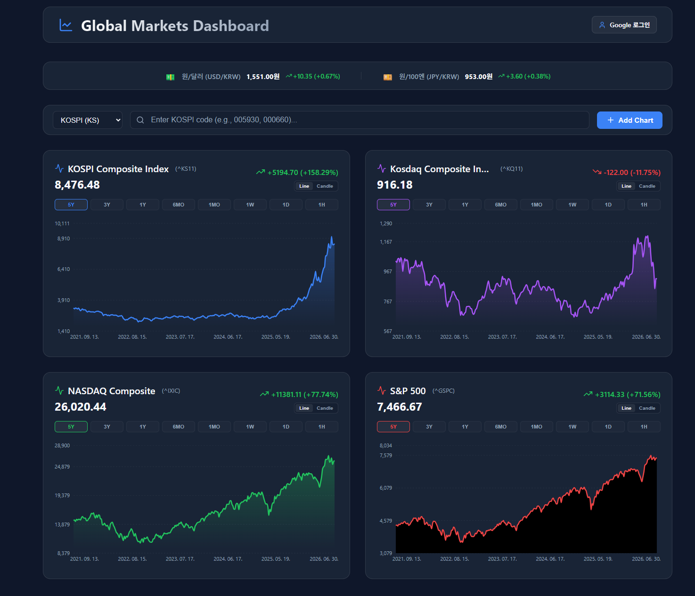

[](https://github.com/ethanjoh/mystock/releases)
# Global Markets & Stock Portfolio Dashboard (My Stock)

실시간 전세계 시장 지수 및 개별 주식(미국, KOSPI, KOSDAQ)의 시세 확인과 모니터링을 제공하며, Google 로그인 및 Firebase 클라우드 동기화를 통해 나의 포트폴리오 자산을 체계적으로 관리하고 과거 10개년 데이터 기반의 포트폴리오 백테스팅 시뮬레이션을 수행할 수 있는 프리미엄 금융 대시보드 웹 애플리케이션입니다.

유려한 다크 모드 기반의 **Glassmorphism CSS 디자인**이 적용되어 있어 직관적이고 완성도 높은 사용자 경험을 제공합니다.



---

## 🌟 핵심 기능 (Key Features)

### 1. 실시간 글로벌 시장 지수 & 관심종목(Watchlist) 관리
* **글로벌 시장 지표**: 코스피(KOSPI), 코스닥(KOSDAQ), 나스닥(NASDAQ), S&P 500 등 전세계 주요 시장 지수가 기본으로 탑재되어 즉시 시황 파악 가능.
* **글로벌 환율 모니터링 (Exchange Rate Bar)**: 대시보드 최상단 헤더 아래에 원/달러(USD/KRW) 및 원/엔(JPY/KRW) 실시간 환율을 슬림한 띠 형태로 상시 노출.
  * 각 환율 항목 클릭 시, 주식 차트와 동일하게 기간별 추이(`1D`~`5Y`) 및 `Line`/`Candle` 전환이 가능한 **상세 환율 차트 팝업 모달** 제공.
* **통합 검색 및 추가**: 검색 바에서 미국 시장 종목(예: `AAPL`, `TSLA`) 및 한국 시장 종목(KOSPI, KOSDAQ)을 검색해 메인 대시보드에 즉시 실시간 차트를 추가/제거 가능.
  * 한국 시장 종목은 시장 구분(KOSPI, KOSDAQ) 선택 시 티커에 자동으로 `.KS` 또는 `.KQ` 접미사를 처리하여 편의성 극대화.

### 2. 고기능 반응형 주식 차트 (Interactive Stock Charts)
* **Recharts 기반 차트**: 반응형 컨테이너를 사용하여 모든 기기 환경에 맞춰 완벽한 시각화 구현.
* **다양한 조회 기간**: 초단기부터 장기 트렌드 분석까지 총 8가지 기간 옵션 제공 (`5y`, `3y`, `1y`, `6mo`, `1mo`, `1w`, `1d`, `1h`).
* **차트 타입 전환**: **Line(라인) 차트**와 **Candle(캔들) 차트**를 실시간 토글하여 변동성 및 추세를 다른 관점으로 분석 가능.
* **상세 툴팁**: 캔들 모드에서는 시가(Open), 고가(High), 저가(Low), 종가(Close)를 다각적으로 볼 수 있는 고기능 툴팁 제공.
* **시장별 맞춤형 테마**: 국내 주식(빨간색: 상승 / 파란색: 하락)과 미국 주식(초록색: 상승 / 빨간색: 하락)의 양봉/음봉 색상 규칙을 구분 적용하여 가독성 강화.

### 3. Firebase 기반 클라우드 백업 및 보안 인증 (Cloud Sync)
* **Google 간편 로그인**: Firebase Auth를 연동한 구글 계정 로그인 기능 탑재.
* **자동 백업 및 복원 (Silent Sync)**: 로그인 완료 시, 로컬 브라우저에 저장되어 있던 관심종목(Watchlist)과 포트폴리오(Portfolio)를 클라우드 Firestore 데이터베이스와 자동으로 비교 및 복원하여 언제 어디서나 끊김 없는 연속성 보장.
* **수동 클라우드 백업**: 사용자가 원할 때 언제든 '클라우드 백업' 버튼을 눌러 Firestore에 최신 데이터를 백업할 수 있으며, 마지막 백업 시간을 툴팁으로 시각화.
* **이벤트 로깅 (User Activity)**: 사용자가 종목을 추가/삭제하거나 수량을 변경할 때 Firestore의 `events` 컬렉션에 사용자 ID, 타임스탬프와 함께 로깅하여 사용 통계를 안전하게 보관.
* **로컬 Mock 폴백 모드**: Firebase 환경 변수(`.env`)가 부재하거나 로컬 테스트 환경인 경우, 로컬 스토리지를 백엔드 삼아 동작하는 안전한 **Mock Fallback 모드**로 완전 자동 전환.

### 4. 원화(KRW) 환산 포트폴리오 관리 (Asset Management)
* **포트폴리오 담기**: 메인 화면 차트 카드에서 클릭 한 번으로 나의 포트폴리오에 자산 추가.
* **원화 자동 환산**: 실시간 USD/KRW 환율 API(`USDKRW=X`)를 백그라운드에서 추적하여, 미국 주식 자산의 가치를 실시간으로 원화(KRW) 환산해 총 포트폴리오 평가 가치를 종합 산출.
* **보유 수량 조절**: 보유 자산별 수량을 간편하게 수정 및 삭제할 수 있는 사용자 인터페이스 제공.
* **원화 표기 소수점 정밀 최적화**: 국내 지표(KOSPI, KOSDAQ) 및 원/달러, 원/엔 환율 가격, 변동 절대량, 차트 내 툴팁 상세 가격, 포트폴리오 배너 등에서 소수점 이하 자리수를 완전히 제거하고 정수 단위로 포맷팅하여 가독성 강화.

### 5. 10개년 포트폴리오 백테스팅 시뮬레이션 (Portfolio Analysis)
* **역사적 자산 가치 시뮬레이션**: 내 포트폴리오 내의 다수 종목들이 과거에 가지고 있었던 가치를 종합하여 자산 성장 흐름을 백테스팅.
* **다중 주기 시뮬레이션**: 10년, 7년, 5년, 3년, 1년, 6개월 등 총 6가지 백테스팅 주기 설정 가능.
* **환율 역사 데이터 반영**: 각 시점의 역사적 USD/KRW 환율을 적용하여 정밀한 원화 기준 누적 자산 추이 연산 및 시각화.
* **성과 지표 리포트**: 초기 원금 대비 최종 자산 평가금, 누적 수익금, 수익률(Gain/Loss)을 동적으로 산출해 리포트 형태로 시각화.

---

## 🛠 기술 스택 (Tech Stack)

### 프론트엔드 (Frontend)
* **React 19.2.6**: 컴포넌트 기반 UI 개발 및 성능 최적화.
* **TypeScript 6.0.2**: 완전한 정적 타입 시스템 적용을 통한 개발 안정성 확보.
* **Vite 8.0.12**: 고속 빌드 도구 및 최적화된 개발 서버 프록시 구성.
* **Recharts 3.8.1**: 리포트 및 주식 시세 차트 렌더링을 위한 React 차트 라이브러리.
* **Lucide React 1.21.0**: 직관적이고 깔끔한 아웃라인 아이콘 패키지.

### 백엔드 & 데이터베이스 (Backend / Serverless)
* **Firebase (SDK 12.15.0)**:
  * **Firebase Authentication**: Google OAuth 소셜 로그인 구현.
  * **Cloud Firestore**: 관심종목, 포트폴리오 백업 데이터 저장 및 사용자 활동 실시간 로깅.
* **Yahoo Finance API**: 주식/지수/환율 실시간 및 역사 데이터 공급.
  * 개발 환경: Vite의 로컬 개발 서버 `proxy` 설정을 이용한 CORS 회피.
  * 프로덕션 환경: `corsproxy.io` 프록시 터널을 통한 실시간 API 요청 처리.

---

## 📂 프로젝트 구조 (Project Structure)

```
my-stock/
├── .env                  # Firebase 설정 및 API 키 보관 (로컬 전용)
├── .env.example          # 환경 변수 설정 템플릿
├── index.html            # 메인 HTML 엔트리
├── vite.config.ts        # Vite 설정 (Yahoo Finance API 프록시 처리)
├── package.json          # 패키지 정보 및 실행 스크립트 정의
└── src/
    ├── main.tsx          # 애플리케이션 시작점
    ├── App.tsx           # 메인 레이아웃 및 상태 컨트롤러
    ├── App.css           # 전역 스타일 및 반응형 레이아웃 CSS
    ├── index.css         # 테마 컬러 토큰, Glassmorphism, 스피너 등 공통 CSS
    ├── firebase.ts       # Firebase 앱 및 Firestore/Auth 인스턴스 설정
    ├── components/       # UI 컴포넌트
    │   ├── SearchBar.tsx         # 시장 선택(US/KS/KQ) 및 주식 티커 검색기
    │   ├── StockChart.tsx        # 8대 기간/Line-Candle 차트/포트폴리오 토글 차트 카드
    │   ├── PortfolioModal.tsx    # 보유 수량 관리 및 환율 변동 배너 모달
    │   ├── PortfolioAnalysis.tsx # 10개년 백테스팅 및 종합 자산 평가 리포터
    │   ├── LoginModal.tsx        # Firebase 소셜 로그인 시작 및 로컬 테스트 Mock 로그인 버튼 모달
    │   └── ExchangeRateBar.tsx   # 원/달러 및 원/엔 실시간 환율 요약 바 컴포넌트
    └── hooks/            # 핵심 비즈니스 로직 및 API 연동 Custom Hooks
        ├── useRealStockData.ts      # Yahoo Finance 실시간/역사 데이터 페칭 및 자동 폴링 훅
        ├── useFirebaseSync.ts       # Firestore 백업/복구, 구글 인증 및 이벤트 로깅 제어 훅
        └── useSimulatedStockData.ts # 로컬 시뮬레이션용 데이터 생성 훅 (폴백용)
```

---

## 🚀 설치 및 시작 방법 (Getting Started)

### 1. 프로젝트 복제 및 패키지 설치
```bash
git clone <repository-url>
cd my-stock
npm install
```

### 2. 환경 변수(Firebase) 구성
프로젝트 루트 폴더에 `.env` 파일을 생성하고 아래 양식에 맞게 Firebase 웹 앱 프로젝트 정보를 기입합니다.
*(Firebase를 설정하지 않을 경우 앱은 자동으로 **Local Mock fallback 모드**로 작동해 로그인 및 백업을 가상으로 수행할 수 있습니다.)*

```env
VITE_FIREBASE_API_KEY=your_api_key_here
VITE_FIREBASE_AUTH_DOMAIN=your_project_id_here.firebaseapp.com
VITE_FIREBASE_PROJECT_ID=your_project_id_here
VITE_FIREBASE_STORAGE_BUCKET=your_project_id_here.appspot.com
VITE_FIREBASE_MESSAGING_SENDER_ID=your_messaging_sender_id_here
VITE_FIREBASE_APP_ID=your_app_id_here
```

### 3. 로컬 개발 서버 실행
```bash
npm run dev
```
기본적으로 브라우저가 열리며 `http://localhost:5173/mystock/`에서 대시보드를 확인할 수 있습니다.

### 4. 프로덕션 빌드
```bash
npm run build
```
빌드된 파일들은 `dist` 디렉토리에 생성됩니다.

---

## 🔒 라이선스 (License)
이 프로젝트는 개인 개발 학습용으로 제작되었으며, 상업적 재배포를 금합니다.
